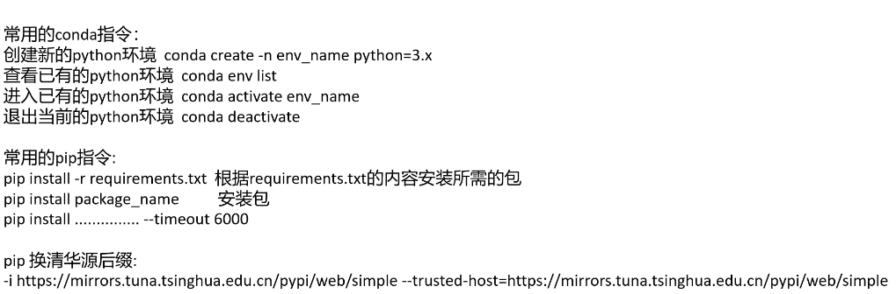
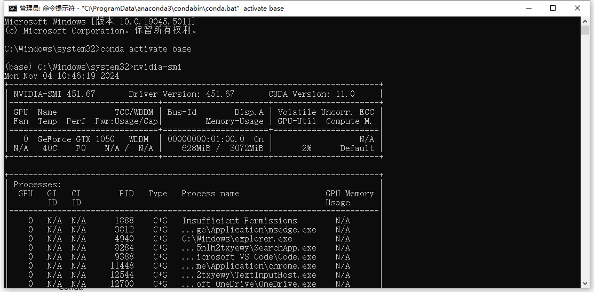

-i https://mirrors.tuna.tsinghua.edu.cn/pypi/web/simple --trusted-host=https://mirrors.tuna.tsinghua.edu.cn/ pypi/web/simple

Conda内置python

如果想使用requirements.txt,就得去文件所在的目录

pip install -r requirements.txt

\# torch==1.7.0 表示手动安装

\# torchvision==0.8.1

如图,cude版本11.0,只要指令里的cuda版本比11.0低就行
